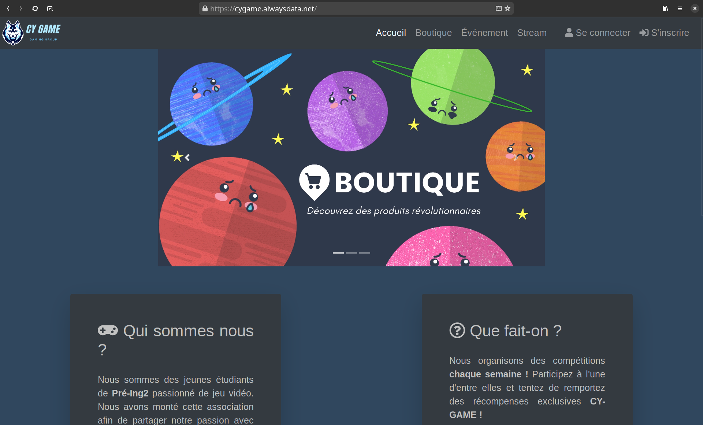
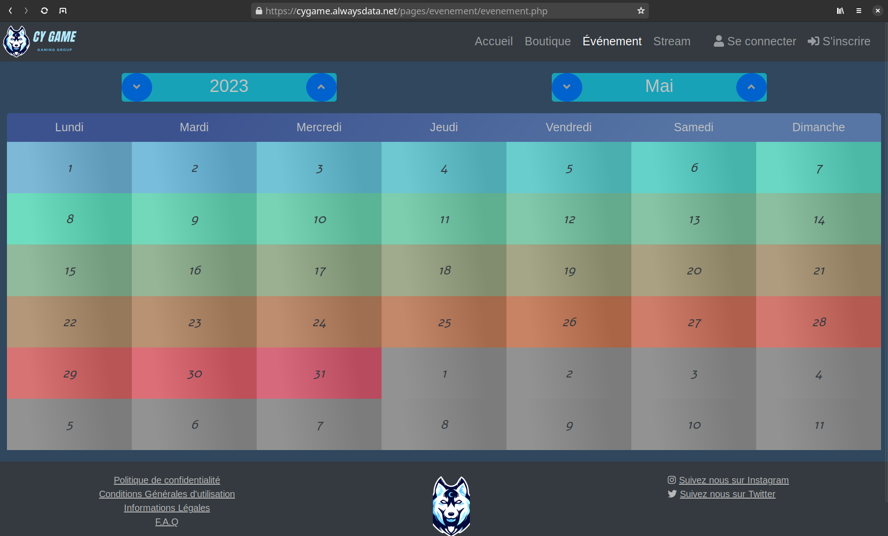
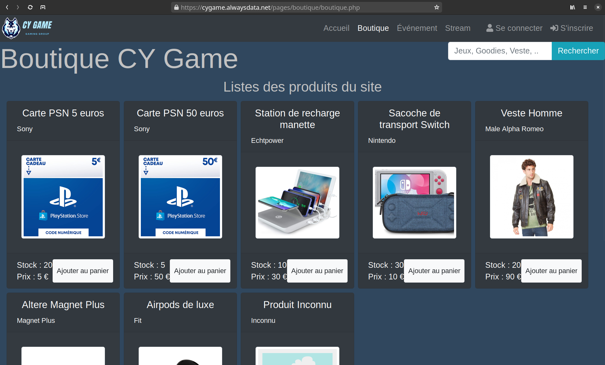
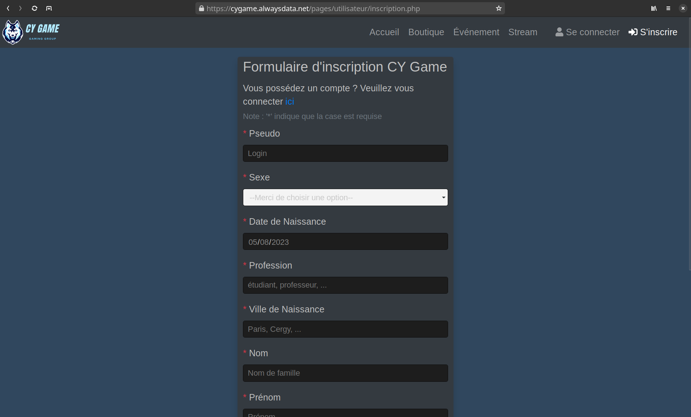

# CY-Game Student Association Website

Welcome to the CY-Game Student Association website repository. This website is designed to bring the association to life, manage registrations and membership fees, and plan actions and events. The website is built using JavaScript, PHP, HTML, CSS, MySQL, Bootstrap, and a little of jQuery.

You can access the website by visiting the following link: [CY Game](https://cygame.alwaysdata.net/)

Note : this is an academic project made in 2021, and the website is not intended to be used in a production environment.

## Preview

- Home Page

- Events

- Shop

- Registration

## Features

The website has three modules for different types of users: Visitor, Member, and Administrator. Each user type will have access to specific functionalities according to their qualification.

### 1. Visitor Module

A simple visitor can access the shop and events, search for a particular product or event using specific keywords and sort the search results according to certain criteria. However, a non-registered visitor cannot buy products from the store or participate in events.

### 2. Member Module

Registered members can create an account, manage and modify their profiles, participate in events, and purchase products from the site. 

#### 2.1 Profile Management

The public part of a profile contains the following information:
- Pseudo (chosen during registration, acts as a login)
- Sex
- Date of birth
- Occupation
- Where applicable, city of residence
- The role

The private part of a profile is accessible only to the user and administrators, containing:
- Real name
- Full address (for delivery)
- Password (modifiable)

#### 2.2 Event Registration

Members can participate in events related to the association, which includes information such as event name, location, start and end date, description, price, and the number of participants.

#### 2.3 Product Purchase

Registered users can purchase products from the site, adding them to the basket, and placing orders.

### 3. Administrator Module

The administrator module allows managing the entire site, including registrations, the shop, and events. However, not all administrators have the same role or privileges and responsibilities.

## Getting Started

You can access the website by visiting the following link: [CY Game](https://cygame.alwaysdata.net/)
To test the website, use the following accounts:

### Administrator Account
- Pseudo: Yasso
- Password: BG-ultime

### Member Account 1
- Pseudo: ChapeauDePaille
- Password: JoyBoy

### Member Account 2
- Pseudo: Sarko
- Password: RoiDesVoleurs

## Customizing the MySQL Database

To customize the MySQL database user and password, modify the `base-de-donnee/base_de_donnee.php` file.

## Contributors

This website has been made with Ilyas Turki, Yannis Labadie, Jeremy Balakrishnan and Mohamed Bekkara as part of an academic project for CY Tech.